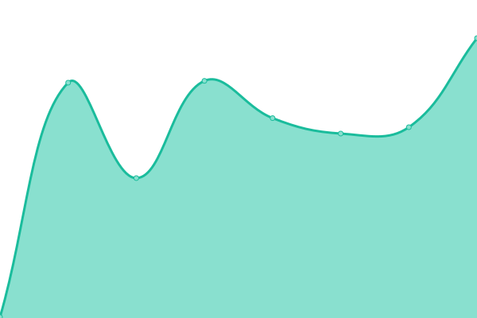

# [📈 Live Status](https://LeastAuthority.github.io/end-users-upptime): <!--live status--> **🟨 Degraded performance**

This repository contains the open-source uptime monitor and status page for [Least Authority](https://leastauthority.com/), powered by [Upptime](https://github.com/upptime/upptime).

With [Upptime](https://upptime.js.org), you can get your own unlimited and free uptime monitor and status page, powered entirely by a GitHub repository. We use [Issues](https://github.com/LeastAuthority/end-users-upptime/issues) as incident reports, [Actions](https://github.com/LeastAuthority/end-users-upptime/actions) as uptime monitors, and [Pages](https://LeastAuthority.github.io/end-users-upptime) for the status page.

<!--start: status pages-->
<!-- This summary is generated by Upptime (https://github.com/upptime/upptime) -->
<!-- Do not edit this manually, your changes will be overwritten -->
<!-- prettier-ignore -->
| URL | Status | History | Response Time | Uptime |
| --- | ------ | ------- | ------------- | ------ |
|  [Least Authority - website](https://leastauthority.com/) | 🟩 Up | [least-authority-website.yml](https://github.com/LeastAuthority/end-users-upptime/commits/HEAD/history/least-authority-website.yml) | 

 1213ms
     
 | 

<a href="https://LeastAuthority.github.io/end-users-upptime/history/least-authority-website">100.00%</a>
    

|  [Least Authority - redirect](http://leastauthority.com/) | 🟩 Up | [least-authority-redirect.yml](https://github.com/LeastAuthority/end-users-upptime/commits/HEAD/history/least-authority-redirect.yml) | 

 682ms
     
 | 

<a href="https://LeastAuthority.github.io/end-users-upptime/history/least-authority-redirect">98.62%</a>
    

|  [Least Authority - de redirect](http://leastauthority.de/) | 🟨 Degraded | [least-authority-de-redirect.yml](https://github.com/LeastAuthority/end-users-upptime/commits/HEAD/history/least-authority-de-redirect.yml) | 

 762ms
     
 | 

<a href="https://LeastAuthority.github.io/end-users-upptime/history/least-authority-de-redirect">0.00%</a>
    

|  [Winden - website](https://winden.app/) | 🟩 Up | [winden-website.yml](https://github.com/LeastAuthority/end-users-upptime/commits/HEAD/history/winden-website.yml) | 

 277ms
     
 | 

<a href="https://LeastAuthority.github.io/end-users-upptime/history/winden-website">100.00%</a>
    

|  [Winden - redirect](http://winden.app/) | 🟩 Up | [winden-redirect.yml](https://github.com/LeastAuthority/end-users-upptime/commits/HEAD/history/winden-redirect.yml) | 

 107ms
     
 | 

<a href="https://LeastAuthority.github.io/end-users-upptime/history/winden-redirect">98.62%</a>
    

|  [Winden - it redirect](http://winden.it/) | 🟩 Up | [winden-it-redirect.yml](https://github.com/LeastAuthority/end-users-upptime/commits/HEAD/history/winden-it-redirect.yml) | 

 246ms
     
 | 

<a href="https://LeastAuthority.github.io/end-users-upptime/history/winden-it-redirect">98.62%</a>
    

|  [Winden - me redirect](http://winden.me/) | 🟩 Up | [winden-me-redirect.yml](https://github.com/LeastAuthority/end-users-upptime/commits/HEAD/history/winden-me-redirect.yml) | 

 179ms
     
 | 

<a href="https://LeastAuthority.github.io/end-users-upptime/history/winden-me-redirect">98.62%</a>
    

|  [Winden - tech redirect](http://winden.tech/) | 🟩 Up | [winden-tech-redirect.yml](https://github.com/LeastAuthority/end-users-upptime/commits/HEAD/history/winden-tech-redirect.yml) | 

 168ms
     
 | 

<a href="https://LeastAuthority.github.io/end-users-upptime/history/winden-tech-redirect">98.62%</a>
    

|  [Magic Wormhole - mailbox](https://mailbox.mw.leastauthority.com/) | 🟩 Up | [magic-wormhole-mailbox.yml](https://github.com/LeastAuthority/end-users-upptime/commits/HEAD/history/magic-wormhole-mailbox.yml) | 

 540ms
     
 | 

<a href="https://LeastAuthority.github.io/end-users-upptime/history/magic-wormhole-mailbox">100.00%</a>
    

|  [Magic Wormhole - relay](https://relay.mw.leastauthority.com/) | 🟩 Up | [magic-wormhole-relay.yml](https://github.com/LeastAuthority/end-users-upptime/commits/HEAD/history/magic-wormhole-relay.yml) | 

 587ms
     
 | 

<a href="https://LeastAuthority.github.io/end-users-upptime/history/magic-wormhole-relay">100.00%</a>
    

|  [HRO Cloud - payment API](payments.deerfield.leastauthority.com) | 🟩 Up | [hro-cloud-payment-api.yml](https://github.com/LeastAuthority/end-users-upptime/commits/HEAD/history/hro-cloud-payment-api.yml) | 

 141ms
     
 | 

<a href="https://LeastAuthority.github.io/end-users-upptime/history/hro-cloud-payment-api">100.00%</a>
    

|  [HRO Cloud - storage001](storage001.deerfield.leastauthority.com) | 🟩 Up | [hro-cloud-storage001.yml](https://github.com/LeastAuthority/end-users-upptime/commits/HEAD/history/hro-cloud-storage001.yml) | 

 122ms
     
 | 

<a href="https://LeastAuthority.github.io/end-users-upptime/history/hro-cloud-storage001">100.00%</a>
    

|  [HRO Cloud - storage002](storage002.deerfield.leastauthority.com) | 🟩 Up | [hro-cloud-storage002.yml](https://github.com/LeastAuthority/end-users-upptime/commits/HEAD/history/hro-cloud-storage002.yml) | 

 116ms
     
 | 

<a href="https://LeastAuthority.github.io/end-users-upptime/history/hro-cloud-storage002">100.00%</a>
    

|  [HRO Cloud - storage003](storage003.deerfield.leastauthority.com) | 🟩 Up | [hro-cloud-storage003.yml](https://github.com/LeastAuthority/end-users-upptime/commits/HEAD/history/hro-cloud-storage003.yml) | 

 117ms
     
 | 

<a href="https://LeastAuthority.github.io/end-users-upptime/history/hro-cloud-storage003">100.00%</a>
    

|  [Private Storage - website](https://private.storage/) | 🟩 Up | [private-storage-website.yml](https://github.com/LeastAuthority/end-users-upptime/commits/HEAD/history/private-storage-website.yml) | 

 959ms
     
 | 

<a href="https://LeastAuthority.github.io/end-users-upptime/history/private-storage-website">100.00%</a>
    

|  [Private Storage - redirect](http://private.storage/) | 🟩 Up | [private-storage-redirect.yml](https://github.com/LeastAuthority/end-users-upptime/commits/HEAD/history/private-storage-redirect.yml) | 

 197ms
     
 | 

<a href="https://LeastAuthority.github.io/end-users-upptime/history/private-storage-redirect">98.62%</a>
    

|  [Private Storage - app redirect](http://privatestorage.app/) | 🟨 Degraded | [private-storage-app-redirect.yml](https://github.com/LeastAuthority/end-users-upptime/commits/HEAD/history/private-storage-app-redirect.yml) | 

 336ms
     
 | 

<a href="https://LeastAuthority.github.io/end-users-upptime/history/private-storage-app-redirect">98.60%</a>
    

|  [Private Storage - dev redirect](http://privatestorage.dev/) | 🟨 Degraded | [private-storage-dev-redirect.yml](https://github.com/LeastAuthority/end-users-upptime/commits/HEAD/history/private-storage-dev-redirect.yml) | 

 278ms
     
 | 

<a href="https://LeastAuthority.github.io/end-users-upptime/history/private-storage-dev-redirect">98.60%</a>
    

|  [Private Storage - io redirect](http://privatestorage.io/) | 🟩 Up | [private-storage-io-redirect.yml](https://github.com/LeastAuthority/end-users-upptime/commits/HEAD/history/private-storage-io-redirect.yml) | 

 697ms
     
 | 

<a href="https://LeastAuthority.github.io/end-users-upptime/history/private-storage-io-redirect">98.40%</a>
    

|  [Private Storage - online redirect](http://privatestorage.online/) | 🟩 Up | [private-storage-online-redirect.yml](https://github.com/LeastAuthority/end-users-upptime/commits/HEAD/history/private-storage-online-redirect.yml) | 

 373ms
     
 | 

<a href="https://LeastAuthority.github.io/end-users-upptime/history/private-storage-online-redirect">98.62%</a>
    

|  [Private Storage - org redirect](http://privatestorage.org/) | 🟨 Degraded | [private-storage-org-redirect.yml](https://github.com/LeastAuthority/end-users-upptime/commits/HEAD/history/private-storage-org-redirect.yml) | 

 298ms
     
 | 

<a href="https://LeastAuthority.github.io/end-users-upptime/history/private-storage-org-redirect">98.61%</a>
    

|  [Private Storage - tech redirect](http://privatestorage.tech/) | 🟨 Degraded | [private-storage-tech-redirect.yml](https://github.com/LeastAuthority/end-users-upptime/commits/HEAD/history/private-storage-tech-redirect.yml) | 

 254ms
     
 | 

<a href="https://LeastAuthority.github.io/end-users-upptime/history/private-storage-tech-redirect">98.61%</a>
    

|  [Private Storage - payment API](payments.private.storage) | 🟩 Up | [private-storage-payment-api.yml](https://github.com/LeastAuthority/end-users-upptime/commits/HEAD/history/private-storage-payment-api.yml) | 

 124ms
     
 | 

<a href="https://LeastAuthority.github.io/end-users-upptime/history/private-storage-payment-api">100.00%</a>
    

|  [Private Storage - storage001](storage001.private.storage) | 🟩 Up | [private-storage-storage001.yml](https://github.com/LeastAuthority/end-users-upptime/commits/HEAD/history/private-storage-storage001.yml) | 

 42ms
     
 | 

<a href="https://LeastAuthority.github.io/end-users-upptime/history/private-storage-storage001">100.00%</a>
    

|  [Private Storage - storage002](storage002.private.storage) | 🟩 Up | [private-storage-storage002.yml](https://github.com/LeastAuthority/end-users-upptime/commits/HEAD/history/private-storage-storage002.yml) | 

 37ms
     
 | 

<a href="https://LeastAuthority.github.io/end-users-upptime/history/private-storage-storage002">100.00%</a>
    

|  [Private Storage - storage003](storage003.private.storage) | 🟩 Up | [private-storage-storage003.yml](https://github.com/LeastAuthority/end-users-upptime/commits/HEAD/history/private-storage-storage003.yml) | 

 36ms
     
 | 

<a href="https://LeastAuthority.github.io/end-users-upptime/history/private-storage-storage003">100.00%</a>
    

|  [Private Storage - storage004](storage004.private.storage) | 🟩 Up | [private-storage-storage004.yml](https://github.com/LeastAuthority/end-users-upptime/commits/HEAD/history/private-storage-storage004.yml) | 

 43ms
     
 | 

<a href="https://LeastAuthority.github.io/end-users-upptime/history/private-storage-storage004">99.83%</a>
    

|  [Private Storage - storage005](storage005.private.storage) | 🟩 Up | [private-storage-storage005.yml](https://github.com/LeastAuthority/end-users-upptime/commits/HEAD/history/private-storage-storage005.yml) | 

 43ms
     
 | 

<a href="https://LeastAuthority.github.io/end-users-upptime/history/private-storage-storage005">100.00%</a>
    

|  [Private Storage - matomo](https://matomo.private.storage/) | 🟩 Up | [private-storage-matomo.yml](https://github.com/LeastAuthority/end-users-upptime/commits/HEAD/history/private-storage-matomo.yml) | 

 1467ms
     
 | 

<a href="https://LeastAuthority.github.io/end-users-upptime/history/private-storage-matomo">100.00%</a>
    

<!--end: status pages-->

[**Visit our status website →**](https://LeastAuthority.github.io/end-users-upptime)

## 📄 License

- Powered by: [Upptime](https://github.com/upptime/upptime)
- Code: [MIT](./LICENSE) © [Least Authority](https://leastauthority.com/)
- Data in the `./history` directory: [Open Database License](https://opendatacommons.org/licenses/odbl/1-0/)
